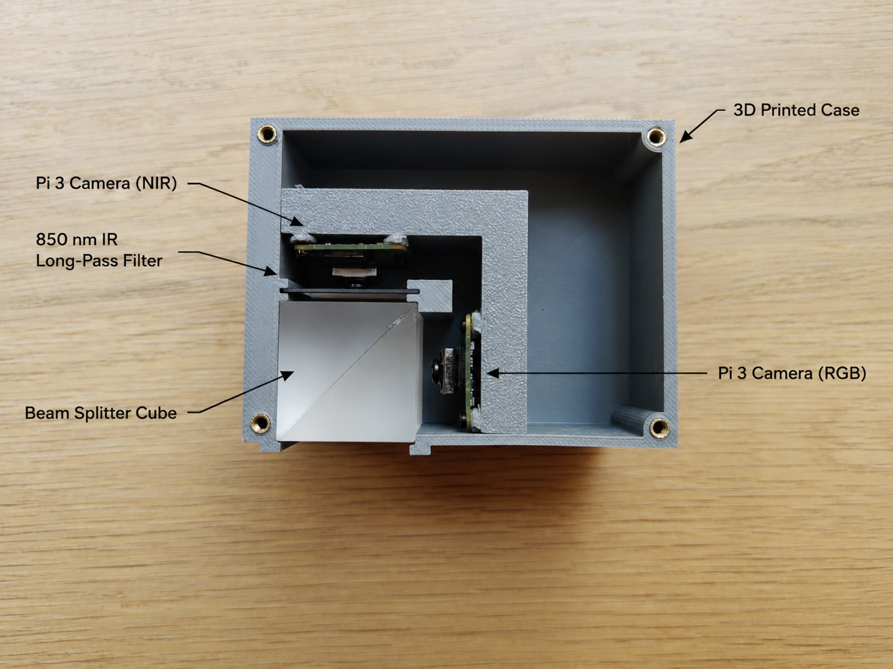
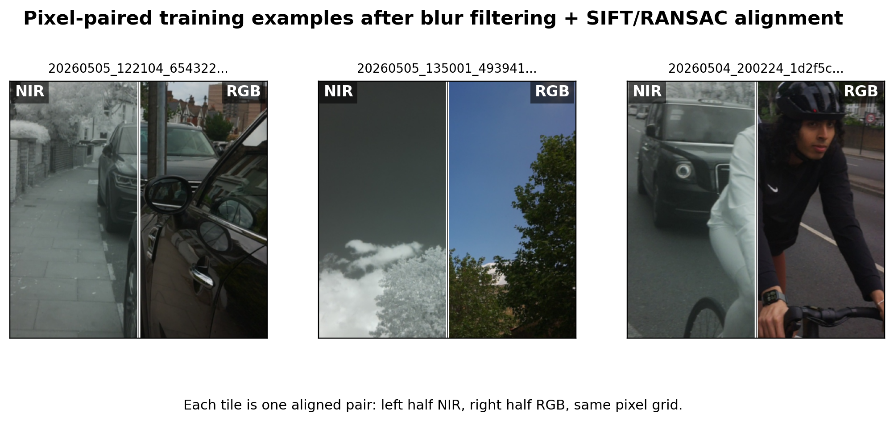
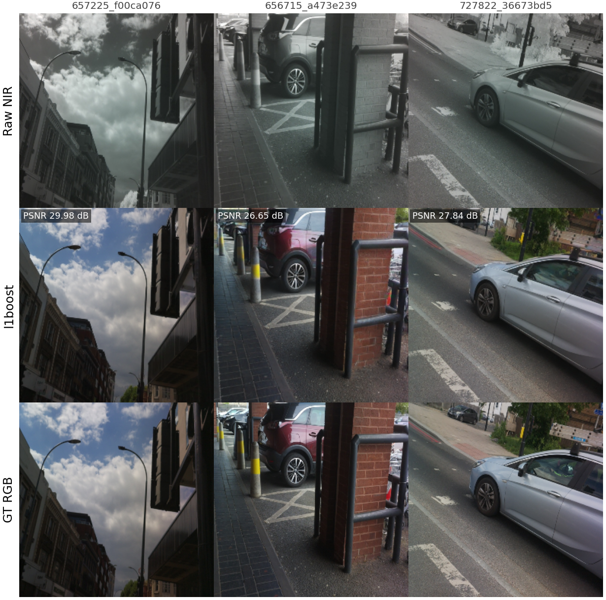

<div align="center">

# Edge-Deployable NIR→RGB Translation as a Pre-Processor for Pre-Trained Vision Models

**MEng Final-Year Project · Imperial College London · 2026**

Samuel Barber · Supervisor: Prof. Cong Ling

[](report/main.pdf)
[](presentation/slides.pdf)
[](paper/wacv2027_draft.pdf)
[](LICENSE.md)


</div>

---

## TL;DR

Modern vision models are trained almost entirely on visible-band **RGB** imagery and
degrade badly on **near-infrared (NIR)** input. Retraining every downstream model on NIR
is impractical. This project instead builds a **translator that sits between the NIR sensor
and an unmodified, frozen RGB model** — and judges it by a stricter criterion than image
quality: *how much of each frozen model's native-RGB behaviour the translation recovers.*

A 116 M-parameter NAFNet **teacher**, trained with feature-matching losses against frozen
foundation models, is distilled into a **1.7 M-parameter student (67.3× smaller)** and
exported as a deterministic **2.3 MB mixed-INT8 LiteRT** artefact that runs in real time on
a Raspberry Pi 5.

## Headline results

| | Result |
|---|---|
| **Dataset** | 12,536 simultaneous, homography-aligned NIR/RGB pairs, captured across London on a custom shared-aperture beam-splitter rig |
| **Teacher** | 116 M-param NAFNet, feature-matching losses vs. frozen **DINOv2 + CLIP + ResNet-50** (in place of a single perceptual term) |
| **Student** | 1.7 M params — a **67.3× reduction** — exported to a **2.3 MB mixed-INT8 LiteRT** artefact |
| **Downstream gap closure** | **Positive on all 5 primary tasks** spanning detection, segmentation, and depth |
| **Latency** | **5.05 FPS** on Raspberry Pi 5 CPU · **27.2 FPS** on Hailo-8L NPU (target: ≥ 5 FPS) |
| **Key finding** | A Pix2Pix baseline matching the student on **PSNR/SSIM recovers almost none** of the downstream behaviour — feature-space supervision and behaviour-centred evaluation, *not* pixel fidelity, are what make a translation pre-processor useful |

## The capture rig

Supervising a translator needs NIR and RGB of the **same scene at the same instant**. A
custom, hand-built rig splits one optical path with a beam-splitter cube onto two
Raspberry Pi cameras — one behind an 850 nm long-pass filter (NIR), one unfiltered (RGB) —
all inside a 3D-printed case. Carried around London, it captured **12,536** simultaneous
pairs.

<table>
<tr>
<td width="50%"></td>
<td width="50%"></td>
</tr>
<tr>
<td align="center"><em>Internals: beam-splitter cube, 850 nm NIR camera, RGB camera, 3D-printed case.</em></td>
<td align="center"><em>Deployed in the field — capturing paired data on the move around London.</em></td>
</tr>
</table>

After capture, pairs are blur-filtered and **SIFT/RANSAC homography-aligned** so NIR and RGB
share a pixel grid:

<div align="center">

</div>

## Repository layout

```text
nir-to-rgb/
├── report/          Final thesis PDF, LaTeX, bibliography, figures and figure tools
├── presentation/    Final slides PDF, Beamer source, theme assets and live Pi demo
├── training/        Model code, configs, training, evaluation and export scripts
│   ├── src/         Data loading, NAFNet/UNet, losses, trainers and metrics
│   ├── scripts/     Training, inference, evaluation, export and benchmarks
│   ├── configs/     Teacher, student, baseline and ablation recipes
│   └── experiments/ Recorded evaluation results and run provenance
├── evidence/pi/     Raspberry Pi and Hailo benchmark records
└── paper/           Condensed paper draft, sharing the report's bibliography
```

## The idea in one diagram

```
        NIR sensor          ┌───────────────────────┐        Frozen, unmodified
   (850 nm long-pass)  ──▶  │  NIR→RGB translator   │  ──▶   RGB vision model
                            │  (1.7 M student, INT8)│        (YOLO / seg / depth /
                            └───────────────────────┘         CLIP / DINOv2)
   No colour, wrong           Trained to preserve            Works as if it were
   material appearance        *downstream behaviour*         looking at real RGB
```

## Results

**Translation quality** — raw NIR → translated RGB → ground-truth RGB (per-pair PSNR shown):

<div align="center">

</div>


## Method, briefly

1. **Data.** A Raspberry-Pi-based beam-splitter rig captures NIR and RGB through a shared
   aperture at the same instant, then homography-aligns each pair — 12,536 pairs total.
2. **Teacher.** A 116 M NAFNet is trained with **feature-matching losses** against frozen
   DINOv2, CLIP, and ResNet-50, so the translation is optimised for what downstream models
   *see*, not for pixel PSNR.
3. **Distillation.** The teacher is distilled into a 1.7 M student and quantised to a
   deterministic mixed-INT8 LiteRT export for the edge.
4. **Deployment.** The student runs at 5.05 FPS on the Pi 5 CPU and 27.2 FPS on the
   Hailo-8L NPU, meeting the real-time target.
5. **Evaluation.** Every model is scored by **gap closure** — the fraction of each frozen
   model's native-RGB performance recovered on translated NIR — across detection,
   segmentation, and depth.

## Training and reproduction

See [the training guide](training/README.md) for setup, paired-data preparation,
teacher training, student distillation, evaluation and export commands.

- **Report teacher:** [`ablation_15b_l1boost_split42_s2.yaml`](training/configs/ablation_15b_l1boost_split42_s2.yaml).
- **Deployed student:** [`student_l1b_c_featkd.yaml`](training/configs/student_l1b_c_featkd.yaml).
  Its recorded teacher checkpoint is the seed-8065 L1-boost run; the guide explains
  how to train that parent or explicitly select a different teacher.
- **Recorded results:** [`training/experiments/`](training/experiments/), including
  canonical evaluation, quantised-student results, ablations and robustness.
- **Hardware evidence:** [`evidence/pi/`](evidence/pi/).

The raw paired dataset, trained checkpoints and exported ONNX/LiteRT/HEF models
are not included. Checkpoints and exports are stored in Weights & Biases and are
available on request. You can train a similar model using your own aligned pairs;
reproducing the reported numbers requires the original data and checkpoints.

## Report and presentation

- **[Final report](report/main.pdf)** — the authoritative thesis and results.
- **[Presentation](presentation/slides.pdf)** — 27 slides, Samuel Barber, 25 June 2026.
- **[Live Raspberry Pi demo](presentation/live-pi-demo.mp4)**.
- **[Paper draft](paper/wacv2027_draft.pdf)** — condensed WACV-style version.

LaTeX sources and build instructions are in [report/](report/README.md),
[presentation/](presentation/README.md) and [paper/](paper/README.md).

## License

The written report, figures, and this documentation are licensed under
[**CC BY-NC 4.0**](LICENSE.md). Please attribute and do not use commercially.

The bundled Imperial presentation theme, logos and fonts retain their own
[license notices](presentation/LICENSE.txt).
